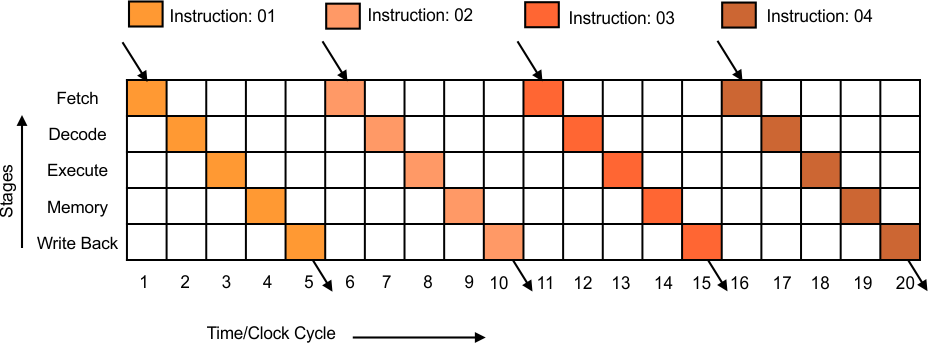

# RISC-V Simulator
##### _An application to simulate the execution of machine code in RISC-V ISA_
#

```
Contributors:
Jitender Jangra :- 2022MCB1318
Divyanshu Sharma :- 
Garvit Bhalla :- 

```
#
RISC-V is an open standard instruction set architecture based on established reduced instruction set computer principles. The RISC-V ISA is provided under open source licenses that do not require fees to use.
#
*RISC-V Simulator* is an application that can simulate the execution of machine code by showing the changes that occur in the memory and registers and the flow of data during runtime.

- The current version supports the simulation for *32 bit* machine only.
- Execution of each instruction is further split into 5 different parts: Fetch, Decode, Execute, Memory Access and Register Update.
- At any step, user can jump directly to the end of the program, execute the current instruction and jump to next and jump to the previous instruction or execute current substep and jump to next substep.

### Instructions Supported
```
R format  - add, and, or, sll, slt, sra, srl, sub, xor, mul, div, rem
I format  - addi, andi, ori, lb, ld, lh, lw, jalr
S format  - sb, sw, sd, sh
SB format - beq, bne, bge, blt
U format  - auipc, lui
UJ format - jal

The simulator also prints messages for each stage to the out.json. The format is described below:
- Each stage starts by printing the name of the stage, e.g. at the beginning of decode stage “DECODE” is printed
- All logged data inside a stage is indented. 
- Any time memory is read or written to, PMI module will log “Reading <<Datatype>> from memory location <<MAR>>” or “Writing <<Datatype>> <<MDR>> to memory location <<MAR>>” where <<Datatype>> is byte, halfword or word, <<MDR>> is MDR in hex, and <<MAR>> is MAR in hex
## Project Structure
- `main.cpp` - Core implementation of the simulator
- `utility.hpp` - Helper functions and instruction processing logic
- `input.mc` - Input file containing machine code instructions
- `output.txt` - Output file with final register and memory states
- `out.json` - Detailed execution trace in JSON format
- `datapath.mmd` - Mermaid diagram showing processor datapath

## Instruction Processing Flow
1. **Fetch Stage**
   - Reads instruction from memory using PC
   - Updates IR and calculates next PC

2. **Decode Stage**
   - Extracts instruction fields
   - Sets control signals
   - Reads register values

3. **Execute Stage**
   - Performs ALU operations
   - Handles arithmetic, logical, and branch operations

4. **Memory Stage**
   - Performs memory read/write operations
   - Updates memory registers

5. **Write Back Stage**
   - Updates destination registers

## Control Signals
Key control signals include:
- RF_Write: Register file write control
- MuxB_select: ALU input selection
- MuxY_select: Write-back path selection
- Mem_Read/Write: Memory operation control
- ALUOp[15]: ALU operation selection

# Directory structure
RISC-V-Simulator/
├
├── main.cpp
└── utility.hpp
|
└── input.mc
├
├── output.txt
└── out.json
├── docs/
│   ├── datapath.mmd
│   └── documentation.txt
└── README.md

## Processor Architecture

### Non-Pipelined Implementation


## Future Enhancements
1. Pipeline implementation
2. Cache memory support